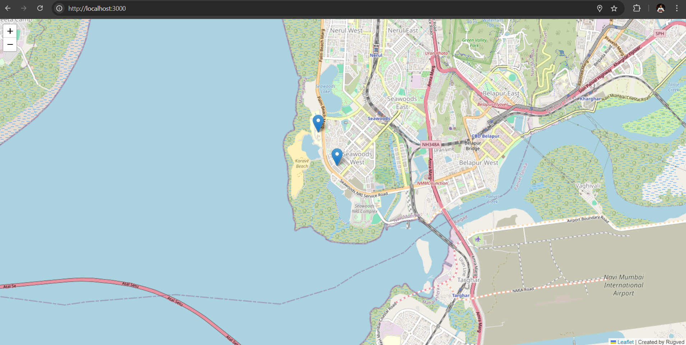

# 📍 Realtime Location Tracking Application
This project showcases a **real-time location tracking system** built using modern web technologies. It enables live updates on user locations, making it perfect for services like:

- 🍔 **Food Delivery Apps** (e.g., Zomato, Swiggy)
- 🚕 **Taxi Services** (e.g., Uber, Ola)
- 🛒 **E-commerce & Quick Commerce** (e.g., Blinkit, Instamart, Zepto)

### 🎯 Features:
- **Live Location Tracking**: See user locations in real-time, making coordination efficient.
- **Seamless Integration**: Designed for quick integration into any service that requires real-time tracking.
- **Scalability**: Capable of handling multiple users with real-time socket communication.
  
### 🚀 Tech Stack:
- **Node.js**: Backend server to handle requests and manage user sessions.
- **Socket.IO**: Real-time, bi-directional communication between the server and the clients.
- **EJS**: Server-side templating engine to dynamically render views.
- **Express.js**: Minimal and flexible Node.js web application framework.

---

